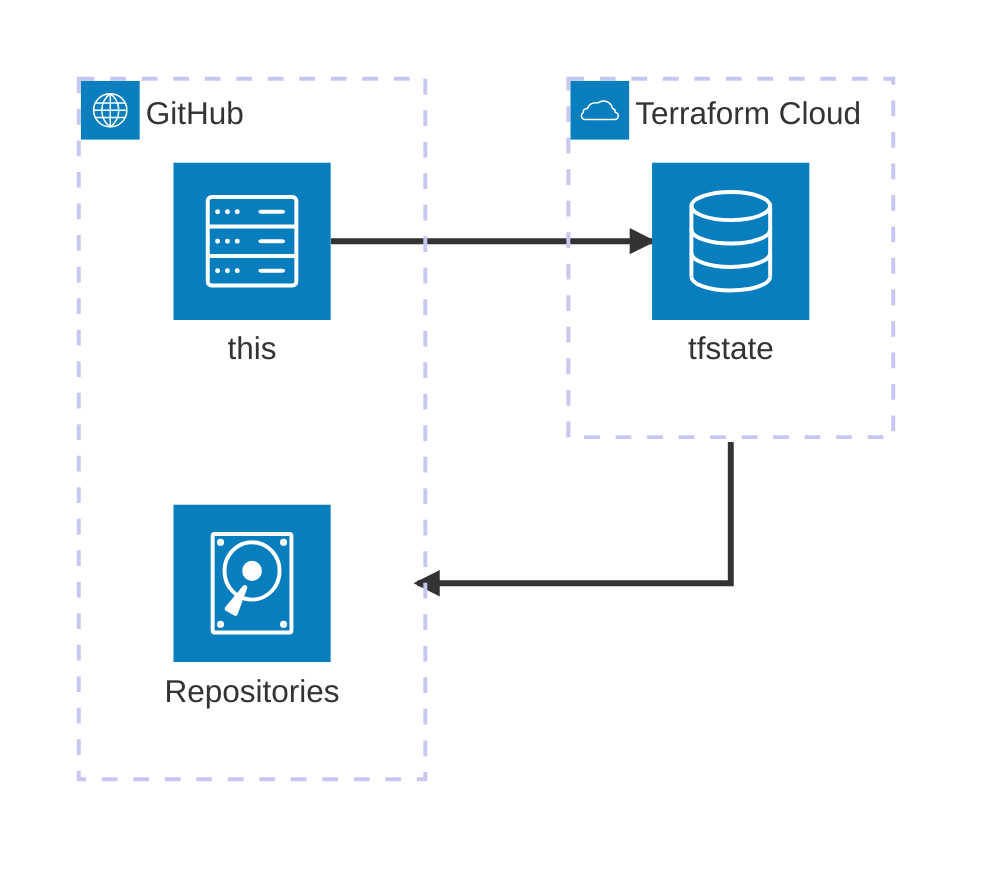

# About
repositories managed by Terraform.

# Architecture
<!-- https://icones.js.org/collection/logos -->

## Backend: Terraform Cloud
tfstate is managed in [Terraform Cloud](https://app.terraform.io/app).
