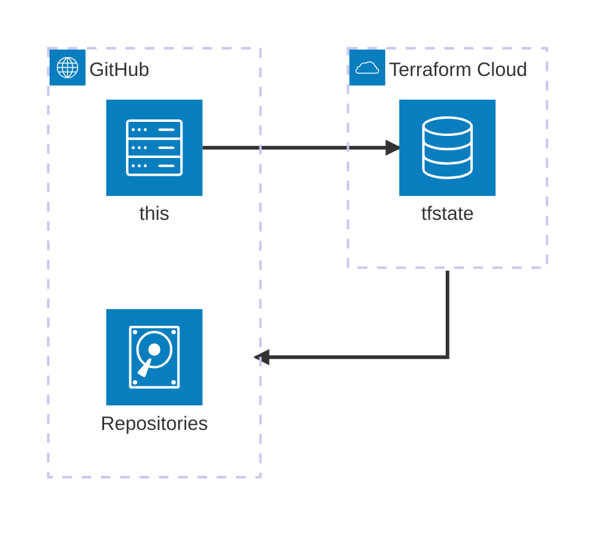

# About
Repositories are managed by Terraform.

# Architecture
<!-- https://icones.js.org/collection/logos -->

## Backend: Terraform Cloud
tfstate is managed in [Terraform Cloud](https://app.terraform.io/app).

Execution mode is set to [local](https://developer.hashicorp.com/terraform/cloud-docs/workspaces/settings#execution-mode), so terraform plan/apply will be executed in local machine or GitHub Actions.

## GitHub App: Terraform Plan / Apply
For terraform plan/apply in GitHub Actions, GitHub App is configured.
- Terraform Plan: https://github.com/settings/apps/terraform-plan
- Terraform Apply: https://github.com/settings/apps/terraform-apply

> [!WARNING]
These GitHub Apps are not managed by terraform. Managing GitHub Apps itself is not supported in GitHub provider now. Data source is only available in v6.3.1.
https://registry.terraform.io/providers/integrations/github/latest/docs

