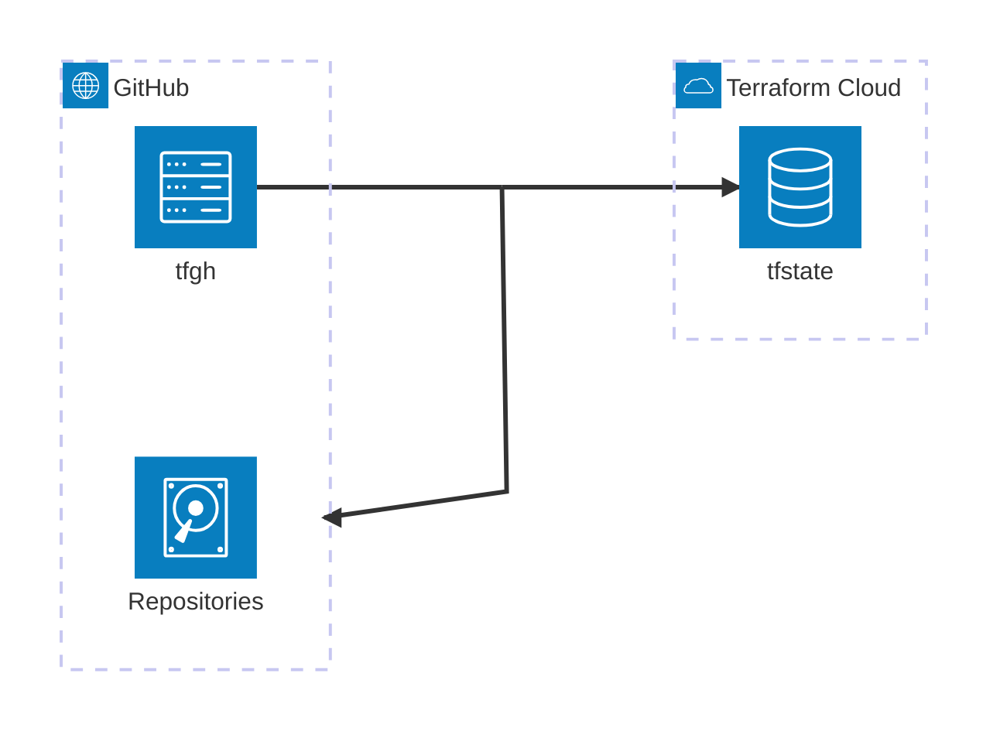

# About
Repositories are managed by Terraform.

# Architecture
<!-- https://icones.js.org/collection/logos -->


## Backend: Terraform Cloud
tfstate is managed in [Terraform Cloud](https://app.terraform.io/app).

Execution mode is set to [local](https://developer.hashicorp.com/terraform/cloud-docs/workspaces/settings#execution-mode), so terraform plan/apply will be executed in local machine or GitHub Actions.

## GitHub App: Terraform Plan / Apply
For terraform plan/apply in GitHub Actions, GitHub App is configured.
- Terraform Plan: https://github.com/settings/apps/terraform-plan
- Terraform Apply: https://github.com/settings/apps/terraform-apply

> [!WARNING]
> These GitHub Apps are **not** managed by terraform. Managing GitHub Apps itself is not supported in GitHub provider now. Data source is only available in v6.3.1.
> https://registry.terraform.io/providers/integrations/github/latest/docs

> [!NOTE]
> Terraform Plan apps has content:write permission. If it is not granted, terraform plan cause unexpected behavior and confusing diffs.
> https://registry.terraform.io/providers/integrations/github/latest/docs/resources/repository

## GitHub Environments: Terraform Plan / Apply
For terraform plan/apply in GitHub Actions, GitHub Environment is configured.
- plan/apply: https://github.com/hayas1/tfgh/settings/environments

> [!NOTE]
> These GitHub Environments are managed by terraform.

These GitHub Environments host some secrets for terraform plan/apply in GitHub Actions.

| Secret          | How to obtain when expired                                                                                                                   |
| --------------- | -------------------------------------------------------------------------------------------------------------------------------------------- |
| APP_ID          | GitHub Apps [plan](https://github.com/settings/apps/terraform-plan)/[apply](https://github.com/settings/apps/terraform-apply) settings page. |
| APP_PRIVATE_KEY | GitHub Apps settings page too. **Not Client secrets, just Private keys.**                                                                    |
| TF_API_TOKEN    | Terraform Cloud [user setting](https://app.terraform.io/app/settings/tokens) page. For both plan/apply.                                      |

> [!IMPORTANT]
> These secrets are **not** managed by terraform. Managing secrets in terraform is not recommended because they are stored in plain text in tfstate

# Operations
## Add or import repository
Add repository to [/terraform/repositories.tf](/terraform/repositories.tf).
### Import
```sh
terraform import 'module.repositories.github_repository.this["tfgh"]' tfgh
```

## Delete or remove repository
Delete repository from [/terraform/repositories.tf](/terraform/repositories.tf).
### Remove
```sh
terraform state rm 'module.repositories.github_repository.this["tfgh"]'
```

## Manual operation
Authenticate to GitHub and Terraform Cloud. `terraform login` require authorization token from Terraform Cloud.
```sh
gh auth login
terraform login
```

Now, we can execute terraform plan/apply in local machine.
```sh
cd terraform
terraform init
terraform plan
terraform apply
```

## Do not Terraform Apply in GitHub Actions
Pull request labeled with `manual` will not be applied in GitHub Actions on merged.
Should do terraform apply in local machine as [manual operation section](#manual-operation).
